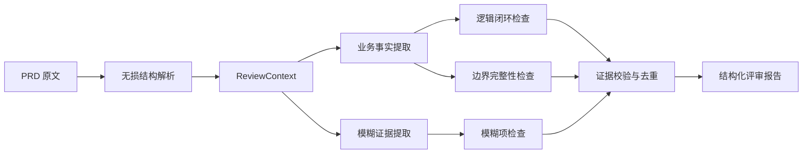

# 2026年06月18日10:39:53

## PRD清洗流程

1. 先读取文档（list\[str\]）
2. 标准化文档（standardization_prd_md.py）
   1. 抽象为树模型：把文章分拆分为大段落、小段落，父段落、子段落（md_node）
   2. 把content中的不规则段落，整合为一句话的形式
   3. 图片处理：识别prd中的流程图、业务图等等。最后挂载到node节点中
   4. 把 md中很大的content分割，利用
3. 文档清洗（md_node）
   1. 结构清洗（Structural Cleaning）（md_node）
   2. 语义噪声清洗（Semantic Noise Removal）（PrdSemanticBlock）
      1. 常见噪声：TODO、待补充、见附件、略、xxx占位 等等
   3. 图片语义抽取（Image Semantic Extraction）：将图片转换为PrdSemanticBlock
   4. 结构归一化（Normalization）（md_node）
      1. 标题标准化
         - 去掉编号、去掉括号序号、trim+去特殊符合
      2. 合并重复节点
         - 当PRD出现多个段落说同一件事，则需要合并，例如 1.1 登录说明，1.2
登录流程，这两个段落说的一件事，需要合并。
   5. 语义增强（Enrichment）（md_node）
      1. 为node增加node_type字段
4. 文档切片
5. 转换为纯业务规则
   1. 录入向量库，为后续PRD评审做准备、知识库问答做准备
   2. 转换为面向测试开发的文档


---


1. Read doc → list[str]

2. Parse → MdNode tree
   (STRUCTURE ONLY)

3. MdNode Cleaning
   - 3.1 Structural Cleaning → MdNode
   - 3.2 Normalization → MdNode

4. Semantic Extraction
   MdNode.content → PrdSemanticBlock[]

5. Semantic Cleaning
   PrdSemanticBlock noise filtering

6. Semantic Enrichment
   PrdSemanticBlock + tags + node link

7. Chunking
   PrdSemanticBlock-based slicing

8. Rule Generation
   PrdSemanticBlock → Rule

9. Output Layer
   - Vector DB
   - Test case system
   - QA agent


## AgentPRD-Flow

### 评审目标
1. 排查PRD中模糊的点，例如：xxx内容略、xxx等以后补充
2. 排查业务逻辑闭环
3. 排查PRD中边界值问题

---


### PRD 自动评审调用

默认先复用完整 PRD 清洗流程，再通过三个独立 LLM Reviewer 生成结构化报告：

```python
from agent_core.agents.prd_review.agent import PrdReviewAgent
from agent_core.models.prd.prd_review_agent_input import PrdReviewAgentInput

report = PrdReviewAgent().run(
    PrdReviewAgentInput(input_path="/path/to/requirement.md")
)
print(report.model_dump_json(indent=2))
```

如果调用方已经持有 `MdNode`，可使用 `review_node`，避免重复解析：

```python
report = PrdReviewAgent().review_node(
    md_node,
    source_path="requirement.md",
)
```

输出模型为 `PrdReviewReport`。三个维度分别是 `ambiguity`、
`logic_closure` 和 `boundary_value`。当某个 Reviewer 的模型调用失败时，
报告通过 `status` 和 `errors` 返回可理解的错误，不会用规则结果冒充 LLM 结论。

测试：

```bash
uv run pytest -q agent_core/test/test_prd_review_agent.py
uv run pytest -q agent_core/test/test_prd_review_agent_real_llm.py -s
```
