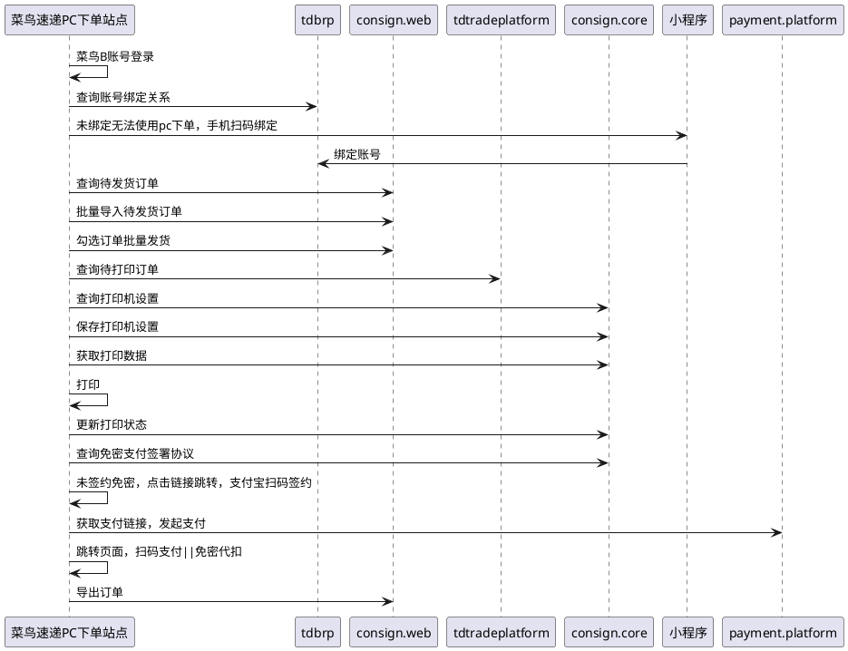

# 菜鸟速递-电脑下单

### 变更记录

| **日期** | **修订人** | **修订内容** |
| --- | --- | --- |
| 2025-10-17 | 檀金玉 | 创建文档 |
|  |  |  |

# 一、背景

## 1.业务背景

## 2.目标价值

## 3.链路

# 二、需求

## 需求描述

| **系统** | **需求** | **负责产品** | **优先级** | **技术负责人** |
| --- | --- | --- | --- | --- |
| 小程序 | 扫码绑定账号 |  |  |  |
| PC端 | 电脑下单 |  |  |  |

## 需求明细

*   **电脑下单新建独立的PC页面**
    
    *   [https://cn-x-gateway.cainiao.com/cone/cnsd-c/queryWaybill](https://cn-x-gateway.cainiao.com/cone/cnsd-c/queryWaybill)
        
*   **页面登录方式：**
    
    *   密码登录:
        
        *   只限账号名和手机号登录，不显示「邮箱」登录;
            
    *   短信登录
        
        *   用户可以通过手机号注册菜鸟会员进行使用：
            
    *   菜鸟账号登录：
        
        *   菜鸟账号应该可以签约免密代扣；
            
    *   淘宝账号登录：
        
        *   淘宝账号应该可以签约免密代扣；
            
*   **使用账号：**
    
    *   微信小程序使用菜鸟会员C端账号;
        
    *   PC端使用菜鸟会员B端账号下的个人主体账号;
        
*   **绑定逻辑：**
    
    *   同一手机号才能进行绑定;
        
    *   校验绑定账号和被绑定账号的1-1绑定关系，不能重复绑定;
        
    *   数据关联查询：订单查询、所有订单操作、专业市场绑定关系，小件员绑定关系;
        

#### PC端整体页面结构：

*   **打单发货：**
    
    *   **订单管理**
        
        *   **发货打单**
            
            *   **待发货**
                
                *   **查询条件筛选项：**筛选条件无创建时间时，默认查询最近三个月的数据
                    
                    *   创建时间
                        
                    *   收件人姓名
                        
                    *   收件人手机
                        
                    *   收件省市
                        
                *   **明细字段：**
                    
                    *   订单号
                        
                    *   物流产品：
                        
                        *   本期默认为「菜鸟标快」
                            
                    *   收件人名称
                        
                    *   收件人手机号
                        
                    *   收件人地址
                        
                    *   发件人名称
                        
                    *   发件人手机号
                        
                    *   发件城市
                        
                    *   包裹重量
                        
                    *   支付方式：
                        
                        *   寄付
                            
                        *   到付
                            
                    *   物品类型
                        
                    *   保价：
                        
                        *   是
                            
                        *   否
                            
                    *   货品声明价值
                        
                    *    备注
                        
                    *   揽收时间：
                        
                        *   默认为「当日揽」
                            
                    *   创建时间
                        
                *   **批量导入：**使用菜鸟模版[菜鸟速递订单导入模板（最多一次导入1000条）.xlsx](https://view.officeapps.live.com/op/view.aspx?src=https%3A%2F%2Fcilogistics-oss.oss-cn-hangzhou.aliyuncs.com%2Fcnd%2F%25E8%258F%259C%25E9%25B8%259F%25E9%2580%259F%25E9%2580%2592%25E8%25AE%25A2%25E5%258D%2595%25E5%25AF%25BC%25E5%2585%25A5%25E6%25A8%25A1%25E6%259D%25BF%25EF%25BC%2588%25E6%259C%2580%25E5%25A4%259A%25E4%25B8%2580%25E6%25AC%25A1%25E5%25AF%25BC%25E5%2585%25A51000%25E6%259D%25A1%25EF%25BC%2589.xlsx&wdOrigin=BROWSELINK)
                    
                    *   导单过程中有进度提醒
                        
                    *   导单完成后，如有导入失败的情况，页面空白处会显示导入错误的行，与错误原因
                        
                    *   导入的订单可以在”导入记录“查看
                        
                    *   单次导入上限：1000条，
                        
                *   **批量发货：****（批量发货的上限？）**
                    
                    *   发货逻辑：
                        
                        *   默认揽收时间为「当日揽」，即90服务产品
                            
                        *   默认物流产品为「菜鸟标快」
                            
                        *   不支持包装服务，若客户有包装诉求，可在小件员端让小件员进行添加
                            
                    *   报价&计费
                        
                        *   当同时满足下列条件时需使用专业市场报价下单
                            
                            *   用户菜鸟账号绑定特定专业市场
                                
                            *   用户寄件地址在绑定的特定专业市场AOI内
                                
                        *   其他情况使用散客划线报价进行下单
                            
                    *   选中需发货的订单，点击【批量发货】后弹出弹窗
                        
                        *   弹窗标题：批量发货
                            
                        *   弹窗内容：确认批量发货吗？
                            
                        *   弹窗按钮：【取消】、【确认】
                            
                            *   点击【取消】关闭弹窗
                                
                            *   点击【确认】则弹窗提示发货成功
                                
                                *   弹窗标题：发货成功
                                    
                                *   弹窗内容：您的订单全部发货成功
                                    
                                *   弹窗选项：【关闭】点击则关闭弹窗停留当前页面
                                    
                    *   发货后订单可至打印列表查询
                        
                *   **批量删除****（批量删除的上限？）**
                    
                    *   选中需删除的订单，点击【批量删除】后弹出弹窗
                        
                        *   弹窗标题：批量删除
                            
                        *   弹窗内容：确认批量删除吗？
                            
                        *   弹窗按钮：【取消】、【确认】
                            
                            *   点击【取消】关闭弹窗
                                
                            *   点击【确认】则删除已选中的订单
                                
            *   **打印列表：**
                
                *   **查询条件筛选项：**筛选条件无创建时间时，默认仅查询最近一周数据
                    
                    *   创建时间
                        
                    *   打印时间
                        
                    *   打印状态
                        
                        *   未打印
                            
                        *   提交打印
                            
                        *   打印成功
                            
                        *   打印失败
                            
                    *   运单号-已支持多多运单查询
                        
                    *   订单号
                        
                    *   收件人
                        
                    *   收件人手机
                        
                    *   发件人
                        
                    *   发件人手机
                        
                    *   下单终端
                        
                        *   PC端
                            
                        *   微信小程序
                            
                        *   支付宝小程序
                            
                *   **按钮：**
                    
                    *   查询
                        
                    *   重置
                        
                *   **批量打印：**
                    
                    *   可以筛选列表进行打印，不筛选的情况下，默认打印全部
                        
                    *   订单支持重复打印，【已取消】的订单无法勾选打印
                        
                    *   打印最大限制100，超过100单不可选择
                        
                *   **选择打印机：**
                    
                    *   [https://open.taobao.com/doc.htm?docId=107052&docType=1#ss11](https://open.taobao.com/doc.htm?docId=107052&docType=1#ss11)
                        
                    *   历史文档：[开放平台-文档中心](https://support-cnkuaidi.taobao.com/doc.htm?spm=a219a.7386653.0.0.1508669adify2d#?docId=108595&docType=1)
                        
                    *   云打印操作手册：[云打印编辑器使用手册.pdf](https://cloudprint-docs-resource.oss-cn-shanghai.aliyuncs.com/%E4%BD%BF%E7%94%A8%E6%89%8B%E5%86%8C/%E4%BA%91%E6%89%93%E5%8D%B0%E7%BC%96%E8%BE%91%E5%99%A8%E4%BD%BF%E7%94%A8%E6%89%8B%E5%86%8C.pdf)
                        
                    *   打印模版：[设计器](https://cloudprint.cainiao.com/print/templates.htm)
                        
                *   **近一周发货数据**
                    
                    *   点击后下方明细数据默认展示近7天的数据
                        
                *   **近一月发货数据**
                    
                    *   点击后下方明细数据默认展示近30天的数据
                        
                *   **明细字段**
                    
                    *   运单号
                        
                    *   订单号
                        
                    *   收件人
                        
                    *   收件人联系方式
                        
                    *   收件人省
                        
                    *   收件人市
                        
                    *   收件人区县
                        
                    *   收件人地址
                        
                    *   发件人
                        
                    *   发件人联系方式
                        
                    *   发件城市
                        
                    *   物流产品
                        
                    *   创建时间
                        
                    *   订单来源
                        
                    *   商品名称
                        
                    *   订单备注
                        
                    *   运单状态
                        
                    *   打印时间
                        
                    *   下单终端
                        
                    *   打印状态
  