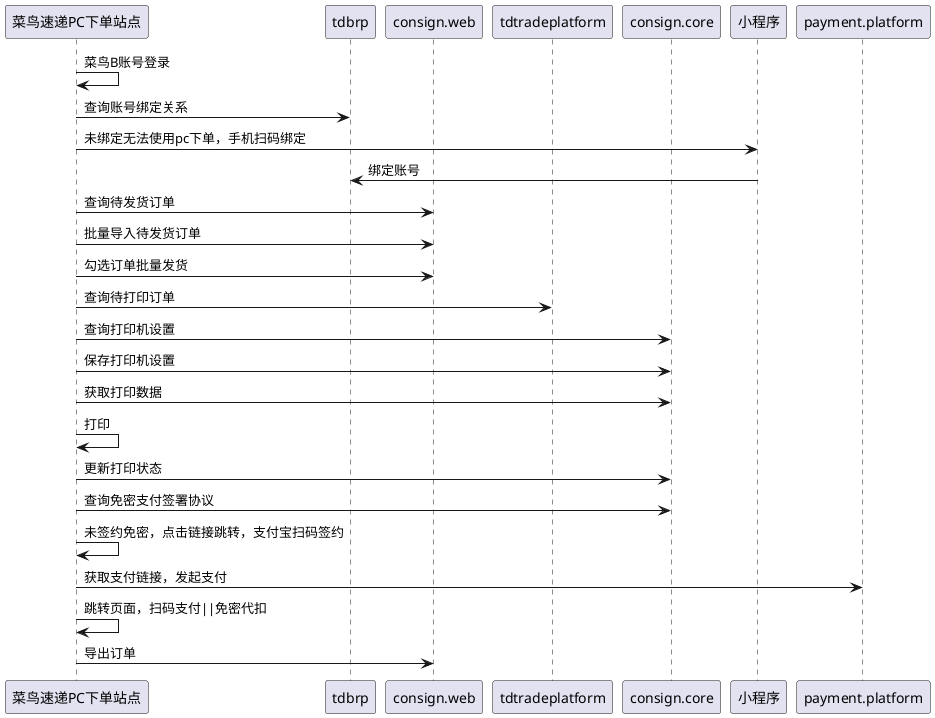

# 菜鸟速递-电脑下单

### 变更记录

| **日期** | **修订人** | **修订内容** |
| --- | --- | --- |
| 2025-10-17 | 檀金玉 | 创建文档 |
|  |  |  |

# 一、背景

## 1.业务背景

## 2.目标价值

## 3.链路

# 二、需求

## 需求描述

| **系统** | **需求** | **负责产品** | **优先级** | **技术负责人** |
| --- | --- | --- | --- | --- |
| 小程序 | 扫码绑定账号 |  |  |  |
| PC端 | 电脑下单 |  |  |  |

## 需求明细

*   **电脑下单新建独立的PC页面**
    
    *   [https://cn-x-gateway.cainiao.com/cone/cnsd-c/queryWaybill](https://cn-x-gateway.cainiao.com/cone/cnsd-c/queryWaybill)
        
*   **页面登录方式：**
    
    *   密码登录:
        
        *   只限账号名和手机号登录，不显示「邮箱」登录;
            
    *   短信登录
        
        *   用户可以通过手机号注册菜鸟会员进行使用：
            
    *   菜鸟账号登录：
        
        *   菜鸟账号应该可以签约免密代扣；
            
    *   淘宝账号登录：
        
        *   淘宝账号应该可以签约免密代扣；
            
*   **使用账号：**
    
    *   微信小程序使用菜鸟会员C端账号;
        
    *   PC端使用菜鸟会员B端账号下的个人主体账号;
        
*   **绑定逻辑：**
    
    *   同一手机号才能进行绑定;
        
    *   校验绑定账号和被绑定账号的1-1绑定关系，不能重复绑定;
        
    *   数据关联查询：订单查询、所有订单操作、专业市场绑定关系，小件员绑定关系;
        

#### PC端整体页面结构：

*   **打单发货：**
    
    *   **订单管理**
        
        *   **发货打单**
            
            *   **待发货**
                
                *   **查询条件筛选项：**筛选条件无创建时间时，默认查询最近三个月的数据
                    
                    *   创建时间
                        
                    *   收件人姓名
                        
                    *   收件人手机
                        
                    *   收件省市
                        
                *   **明细字段：**
                    
                    *   订单号
                        
                    *   物流产品：
                        
                        *   本期默认为「菜鸟标快」
                            
                    *   收件人名称
                        
                    *   收件人手机号
                        
                    *   收件人地址
                        
                    *   发件人名称
                        
                    *   发件人手机号
                        
                    *   发件城市
                        
                    *   包裹重量
                        
                    *   支付方式：
                        
                        *   寄付
                            
                        *   到付
                            
                    *   物品类型
                        
                    *   保价：
                        
                        *   是
                            
                        *   否
                            
                    *   货品声明价值
                        
                    *    备注
                        
                    *   揽收时间：
                        
                        *   默认为「当日揽」
                            
                    *   创建时间
                        
                *   **批量导入：**使用菜鸟模版[菜鸟速递订单导入模板（最多一次导入1000条）.xlsx](https://view.officeapps.live.com/op/view.aspx?src=https%3A%2F%2Fcilogistics-oss.oss-cn-hangzhou.aliyuncs.com%2Fcnd%2F%25E8%258F%259C%25E9%25B8%259F%25E9%2580%259F%25E9%2580%2592%25E8%25AE%25A2%25E5%258D%2595%25E5%25AF%25BC%25E5%2585%25A5%25E6%25A8%25A1%25E6%259D%25BF%25EF%25BC%2588%25E6%259C%2580%25E5%25A4%259A%25E4%25B8%2580%25E6%25AC%25A1%25E5%25AF%25BC%25E5%2585%25A51000%25E6%259D%25A1%25EF%25BC%2589.xlsx&wdOrigin=BROWSELINK)
                    
                    *   导单过程中有进度提醒
                        
                    *   导单完成后，如有导入失败的情况，页面空白处会显示导入错误的行，与错误原因
                        
                    *   导入的订单可以在”导入记录“查看
                        
                    *   单次导入上限：1000条，
                        
                *   **批量发货：****（批量发货的上限？）**
                    
                    *   发货逻辑：
                        
                        *   默认揽收时间为「当日揽」，即90服务产品
                            
                        *   默认物流产品为「菜鸟标快」
                            
                        *   不支持包装服务，若客户有包装诉求，可在小件员端让小件员进行添加
                            
                    *   报价&计费
                        
                        *   当同时满足下列条件时需使用专业市场报价下单
                            
                            *   用户菜鸟账号绑定特定专业市场
                                
                            *   用户寄件地址在绑定的特定专业市场AOI内
                                
                        *   其他情况使用散客划线报价进行下单
                            
                    *   选中需发货的订单，点击【批量发货】后弹出弹窗
                        
                        *   弹窗标题：批量发货
                            
                        *   弹窗内容：确认批量发货吗？
                            
                        *   弹窗按钮：【取消】、【确认】
                            
                            *   点击【取消】关闭弹窗
                                
                            *   点击【确认】则弹窗提示发货成功
                                
                                *   弹窗标题：发货成功
                                    
                                *   弹窗内容：您的订单全部发货成功
                                    
                                *   弹窗选项：【关闭】点击则关闭弹窗停留当前页面
                                    
                    *   发货后订单可至打印列表查询
                        
                *   **批量删除****（批量删除的上限？）**
                    
                    *   选中需删除的订单，点击【批量删除】后弹出弹窗
                        
                        *   弹窗标题：批量删除
                            
                        *   弹窗内容：确认批量删除吗？
                            
                        *   弹窗按钮：【取消】、【确认】
                            
                            *   点击【取消】关闭弹窗
                                
                            *   点击【确认】则删除已选中的订单
                                
            *   **打印列表：**
                
                *   **查询条件筛选项：**筛选条件无创建时间时，默认仅查询最近一周数据
                    
                    *   创建时间
                        
                    *   打印时间
                        
                    *   打印状态
                        
                        *   未打印
                            
                        *   提交打印
                            
                        *   打印成功
                            
                        *   打印失败
                            
                    *   运单号-已支持多多运单查询
                        
                    *   订单号
                        
                    *   收件人
                        
                    *   收件人手机
                        
                    *   发件人
                        
                    *   发件人手机
                        
                    *   下单终端
                        
                        *   PC端
                            
                        *   微信小程序
                            
                        *   支付宝小程序
                            
                *   **按钮：**
                    
                    *   查询
                        
                    *   重置
                        
                *   **批量打印：**
                    
                    *   可以筛选列表进行打印，不筛选的情况下，默认打印全部
                        
                    *   订单支持重复打印，【已取消】的订单无法勾选打印
                        
                    *   打印最大限制100，超过100单不可选择
                        
                *   **选择打印机：**
                    
                    *   [https://open.taobao.com/doc.htm?docId=107052&docType=1#ss11](https://open.taobao.com/doc.htm?docId=107052&docType=1#ss11)
                        
                    *   历史文档：[开放平台-文档中心](https://support-cnkuaidi.taobao.com/doc.htm?spm=a219a.7386653.0.0.1508669adify2d#?docId=108595&docType=1)
                        
                    *   云打印操作手册：[云打印编辑器使用手册.pdf](https://cloudprint-docs-resource.oss-cn-shanghai.aliyuncs.com/%E4%BD%BF%E7%94%A8%E6%89%8B%E5%86%8C/%E4%BA%91%E6%89%93%E5%8D%B0%E7%BC%96%E8%BE%91%E5%99%A8%E4%BD%BF%E7%94%A8%E6%89%8B%E5%86%8C.pdf)
                        
                    *   打印模版：[设计器](https://cloudprint.cainiao.com/print/templates.htm)
                        
                *   **近一周发货数据**
                    
                    *   点击后下方明细数据默认展示近7天的数据
                        
                *   **近一月发货数据**
                    
                    *   点击后下方明细数据默认展示近30天的数据
                        
                *   **明细字段**
                    
                    *   运单号
                        
                    *   订单号
                        
                    *   收件人
                        
                    *   收件人联系方式
                        
                    *   收件人省
                        
                    *   收件人市
                        
                    *   收件人区县
                        
                    *   收件人地址
                        
                    *   发件人
                        
                    *   发件人联系方式
                        
                    *   发件城市
                        
                    *   物流产品
                        
                    *   创建时间
                        
                    *   订单来源
                        
                    *   商品名称
                        
                    *   订单备注
                        
                    *   运单状态
                        
                    *   打印时间
                        
                    *   下单终端
                        
                    *   打印状态
                        
*   **物流跟踪：**[您还未签约支付宝免密代扣，请点击完成支付。 签约免密代扣无需逐笔支付，可自动代扣](https://openapi.alipay.com/gateway.do?app_id=2021003189657038&biz_content=%7B%22personal_product_code%22%3A%22GENERAL_WITHHOLDING_P%22%2C%22sign_scene%22%3A%22INDUSTRY%7CPURCHASE%22%2C%22product_code%22%3A%22GENERAL_WITHHOLDING%22%2C%22external_agreement_no%22%3A%222216089021799-706936%22%2C%22access_params%22%3A%7B%22channel%22%3A%22QRCODE%22%7D%7D&charset=utf-8&method=alipay.user.agreement.page.sign&notify_url=https%3A%2F%2Fcf-fund.cainiao.com%2Fpublic%2Fdan_niao%2Falipay.trade.sign.notification%2Falipay.members.danniao_202305041118%2F&return_url=https%3A%2F%2Fcnsd-c.cainiao.com%2FqueryWaybill&sign_type=RSA2&timestamp=2025-11-25+10%3A53%3A14&version=1.0&sign=mHWDz8U%2BZ8anlkWJKIAvJRNdY4j9tOD15oxTzMaXLSwPo0Oa9rGJSi6wqkkYFreit9Qk94J4NJbsUM5LDnNSleLOQahPTiluvGv2swqXtFOOIl2%2Fu%2FyZMR5xoHqV8YJhSFl%2BX3JL8gRniaQTfxBBiG3M6J%2BtvOziqFu1lUPsF7GOWv0AzJZ8cjVFH6wBa%2Fn0%2FFFldzfo9ZxV8Mx9Ke9mDjOwZOsy1uZ9lcD3K12GoM71%2FUCGpwUZUKNQegnugL4L%2FwR0fqMRtflWGjoEM94EMc0j94ST7tkZtKFXrHs7czmX%2Bn66q2CZ%2BLdEeq1r51KRh0J%2FE7%2B%2B8U28%2FmbAahw6Gw%3D%3D)
    
    *   **系统迁移后，需重新签约支付宝免密代扣，弹窗提示用户重新签约**
        
        *   **弹窗标题：温馨提示**
            
        *   **弹窗内容：**
            
            *   **因系统升级，原支付宝免密代扣需重新签订，若仍需使用免密代扣，为避免影响后续订单支付，请及时签订协议**
                
        *   **弹窗按钮：**
            
            *   **\[去签约\]：点击拉起二维码提示客户及时签约**
                
        *   **支持手动关闭弹窗，关闭后则不支持免密代扣**
            
*   *   **查询条件筛选项：**页面展示用户菜鸟账号下所有运单，包含90/96/97服务产品；用户在速递微信小程序同步可查看PC端下单订单；
        
        *   运单创建时间
            
        *   订单号
            
        *   运单号-已支持多多运单查询
            
        *   收件人
            
        *   收件人手机
            
        *   发件人
            
        *   发件人手机
            
        *   运单状态：下拉筛选，单选项，默认为空
            
            *   待上门取件
                
            *   运输中
                
            *   派送中
                
            *   已签收
                
            *   已取消
                
        *   支付状态：下拉筛选，单选项，默认为空
            
            *   待核价
                
            *   待支付
                
            *   支付成功
                
        *   下单终端：下拉筛选，单选项，默认为空
            
            *   PC端
                
            *   微信小程序
                
            *   支付宝小程序
                
    *   **按钮：**
        
        *   查询
            
        *   重置
            
    *   **只看寄付**
        
        *   筛选支付方式为“寄付”的订单明细
            
    *   **只看到付**
        
        *   筛选支付方式为“到付”的订单明细
            
    *   **批量支付：**批量支付的上限，50单？
        
        *   待支付状态才可勾选, 支持移动端和小程序端一起批量支付
            
        *   点击批量支付，拉起浮层展示当前批量支付的订单
            
            *   表格字段：
                
                *   寄件地址：详细地址需脱敏
                    
                *   收件地址：收件地址需脱敏
                    
                *   应付总运费：单位（元），保留两位小数
                    
                *   计费类型：
                    
                *   订单号
                    
            *   应付费用：批量支付的订单总费用
                
            *   按钮：
                
                *   确认支付：跳转收银台，支持客户扫码支付
                    
                *   关闭：关闭浮层
                    
    *   **批量导出：**批量导出的上限范围（5W单?）
        
    *   **明细字段：**
        
        *   运单号：点击后右侧弹出框，显示「运单详情」（需展示哪些节点）
            
        *   订单号：
            
        *   运单状态：同目前独立端运单状态
            
        *   收件人省
            
        *   收件人城市
            
        *   收件人区县
            
        *   收件人详细地址
            
        *   收件人
            
        *   收件人手机
            
        *   寄件人省
            
        *   寄件人城市
            
        *   寄件人区县
            
        *   寄件人详细地址
            
        *   寄件人
            
        *   寄件人手机
            
        *   揽收重量
            
        *   物品类型
            
        *   运单创建时间
            
        *   支付方式
            
        *   是否保价
            
        *   货品声明
            
        *   价值支付状态
            
        *   备注
            
        *   用户id
            
        *   下单终端
            
        *   isMerBenefit
            
        *   总金额（单位：元）
            
        *   实付金额（单位：元）
            
        *   操作：根据不同订单状态和支付状态展示不同操作
            
            *   取消：
                
                *   
                    
            *   修改订单：
                
                *   
                    
                *   点击后弹框弹出，只可修改收件地址信息，逻辑同目前独立端；
                    
                    *   运单号：只读模式
                        
                    *   新收件省市区
                        
                        *   默认展示原收件省市区，用户可选择修改
                            
                    *   新收件详细地址
                        
                        *   默认展示原收件详细地址，用户可填写修改
                            
            *   拦截：
                
                *   点击拦截时，优先判断该笔运单是否为「已支付」状态：
                    
                    *   若为「已支付」，则弹窗展示为下图，点击「确定并支付」后跳转至支付宝收银台；
                        
                    *   
                        
                    *   若为「未支付」，则弹框提醒： 
                        
                        *   文案：该笔订单还未支付，请先支付后发起拦截；
                            
                        *   操作：
                            
                            *   点击后弹出运费详情：
                                
                                *   寄件地址：发件省市-收件省市
                                    
                                *   基础运费
                                    
                                *   计费类型：按重量计费
                                    
                                *   计费重量
                                    
                                *   首重价格
                                    
                                *   优惠券
                                    
                                *   应付费用
                                    
                            *   点击确认支付， 唤起PC端支付宝收银台
                                
                            *   **pc端收款码页面上方倒计时不要写死等后端返回**
                                
                                *   支付成功后跳转回本页面，该笔支付状态更新为「已支付」
                                    
                            *   点击取消，中止本次操作
                                
                
                
                
            *   转寄：
                
            *   改收件信息：
                
            *   去支付：去支付交互逻辑如上
                
        
        | 运单状态 | 支付状态 | 操作 |
        | --- | --- | --- |
        | 待揽收 | 未支付 | 取消、修改订单、去支付 |
        | 运输中 | 未支付 | 拦截、转寄、改收件信息、去支付 |
        | 派送中 | 未支付 | 拦截、转寄、改收件信息、去支付 |
        | 已签收 | 未支付 | 去支付 |
        | 待揽收 | 已支付 | 取消、修改订单 |
        | 运输中 | 已支付 | 拦截、转寄、改收件信息 |
        | 派送中 | 已支付 | 拦截、转寄、改收件信息 |
        | 已签收 | 已支付 | \-- |
        | 已取消 |  | \-- |
        
    *   基础配置：
        
        *   电商店铺管理
            
            *   支持的平台：
                
                *   淘宝、天猫、1688、抖音、小红书、有赞、快手、京东、视频号、其他平台
                    
                    *   点击平台可跳转店铺绑定页
                        
            *   店铺绑定：
                
                *   支付宝代扣签约：
                    
                    *   点击【签约免密代扣】，拉起支付宝授权二维码
                        
                *   授权签约：
                    
                    *   服务协议：
                        
                    *   点击解绑弹出弹窗：
                        
                        *   弹窗标题：您确定解除绑定吗？
                            
                        *   弹窗内容：解除后，您无法通过电子面单进行发货操作
                            
                        *   弹窗按钮：【取消】、【确认】
                            
                            *   点击【取消】关闭弹窗
                                
                            *   点击【确认】则解除绑定关系，需重新授权签约
                                
                *   电子面单订购：
                    
                    *   点击【申请电子面单】跳转电商平台订购
                        
                *   专业市场绑定：
                    
                    *   根据当前选择的店铺类型查询用户绑定的所有专业市场
                        
                    *   绑定专业市场（区分淘系和其他平台，淘系绑定到当前菜鸟B关联的淘宝账号）
                        
        *   月结卡号查询
            
            *   生成专属月结卡号，淘系账号的特殊逻辑固定返回100000，首次生成后存入数据库，后续都从数据库获取月结卡号
                
            
    
*   ~~财务中心：本期只引导客户跳转至小程序开发票~~
    
    *   ~~发票管理页面提示：~~
        
        *   ~~本页面暂不支持开发票，如有需要可扫码跳转至小程序【我的-发票管理】开票~~
            
    *   ~~页面操作：~~
        
        *   ~~通过微信/支付宝扫码可跳转至菜鸟速递小程序~~
            

#### 移动端扫码绑定

*   **扫码绑定入口：**
    
    *   **我的-更多服务-电脑下单：**
        
        *   扫码入口：
            
            *   扫码添加账号
                
        *   操作：
            
            *   点击【扫码添加账号】跳转扫码页，可通过扫码或使用相册照片扫码绑定
                
            *   扫码后跳转落地页，仍用菜鸟原页面
                
                *   页面按钮：
                    
                    *   确定绑定
                        
                        *   若该二维码未绑定本账号，则点击【确定绑定】，提示“绑定成功”，跳转电脑下单页，展示绑定后的结果
                            
                        *   若该二维码已绑定本账号，则点击【确定绑定】，提示“请查看绑定账号和被绑定账号是否存在已绑定关系”，仍停留当前页面
                            
                        *   若该二维码与本账号无对应关系，则点击【确定绑定】，提示“小程序和电脑端账号手机不一致”，仍停留当前页面
                            
                *   页面协议：
                    
                    *   账号绑定授权协议
                        
    *   **微信/支付宝通用扫一扫能力：**
        
        *   扫描后需额外跳转中间页，登录小程序后再跳转至扫码落地页，后续逻辑同上
            
*   **账号解绑/重新绑定**
    
    *   入口：我的-更多服务-电脑下单
        
        *   页面内容：
            
            *   展示已绑定的手机号信息
                
                *   例，15233334444
                    
            *   重新绑定
                
                *   点击则进入扫一扫页面，支持重新扫码
                    
                *   扫码后，仍跳转至扫码落地页，
                    
                    *   若仍为原已绑定的二维码则提示：“请查看绑定账号和被绑定账号是否存在已绑定关系”，仍停留当前页面
                        
                    *   若为新的二维码则重新校验，逻辑同绑定校验
                        
            *   解除绑定
                
                *   点击则代表已当前PC端账号解绑
                    
                    *   移动端不再展示已绑定的账号
                        
                    *   PC端【绑定账号】入口重新展示
                        

# 三、埋点

# 四、相关接口

com.cainiao.tdbrp.client.service.crm.CrmEntityQueryService#queryRelationListByEntity 查询绑定关系

com.cainiao.consign.web.service.services.mtop.PcBuildUrlService#buildUrl 返回绑定URL

com.cainiao.consign.web.service.services.mtop.impl.MtopTradeOrderServiceImpl#pageQueryForNtbAllGgScenes 查询待发货

com.cainiao.consign.web.service.ddport.LowCodeImportCneOrderHandlerImpl 导入待发货订单

com.cainiao.consign.web.controller.order.ntb.CneTradeOrderPageController#takeWaybillForCne 批量发货

com.cainiao.consign.web.service.services.mtop.impl.MtopTradeOrderServiceImpl#deleteNtbOrder批量删除

com.cainiao.tdtradeplatform.openservice.client.service.mtop.OrderCenterQueryMtopService#queryOrderListWithKeywords订单查询

com.cainiao.consign.api.service.query.user.UserSettingsQueryService#getWaybillPrinterSetting 查询打印设置

com.cainiao.consign.service.impl.query.user.UserSettingsQueryServiceImpl#getWaybillPrinterSetting 保存打印设置

com.cainiao.consign.api.service.query.pkg.QueryPrintDataService#queryCnePrintData 获取打印数据

com.cainiao.consign.api.service.command.pkg.PackageWriteService#updatePrintStatus 更新订单打印状态

com.cainiao.consign.api.service.query.user.UserSettingsQueryService#querySignInfo 查询免密支付协议

com.cainiao.cst.payment.client.mtop.PaymentV1MTopService#startPay 获取支付链接

com.cainiao.consign.web.service.ddexport.LowCodeCnsdPcLogisticsTrackingExportHandler#executeExport 导出运单信息